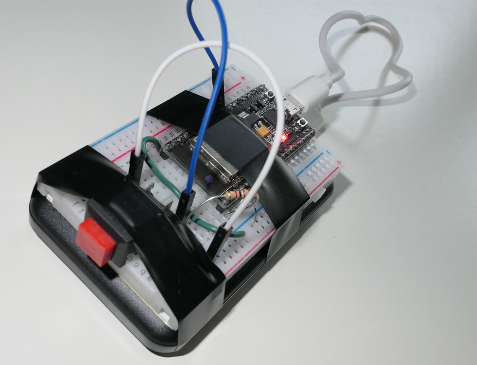

# wifiButtonESP32

This is a simple micropython program run on a esp32 to test out node-red flows. It sends a http request when
a button is pressed (on GPIO16) . It acts a bit like the old Amazon dash buttons.

Uses microWedCli.py code from Jean-Christophe Bos & HC² (www.hc2.fr) Copyright © 2018

